# NewLens Codebase Analysis — Unsupervised News Intelligence Platform
Original Locally hosted State of Codebase in direct implementation.
---

## 🏛️ System Architecture

NewLens follows a decoupled **Client-Server Architecture** designed for high-performance NLP inference:

1. **Backend AI Engine (`app/api.py`):**
   * Built on **FastAPI**.
   * Loads heavy machine learning and transformer models into memory on startup.
   * Exposes RESTful endpoints protected by `X-API-Key` headers.
   
2. **Frontend Dashboard (`app/app.py`):**
   * Built on **Streamlit**.
   * Provides an interactive UI for article input (pasting text or uploading files).
   * Communicates with the FastAPI backend via HTTP requests.
   * Manages UI state dynamically using Streamlit's `session_state`.
   * Renders visual components using Plotly figures generated by the `Visualization` module.

3. **Core NLP Modules (`src/Components/`):**
   * Implements the logic for feature generation, text embeddings, semantic clustering, topic modeling, named entity recognition (NER), summarization, and similarity search.

4. **Containerization (`docker/`):**
   * Features a two-stage optimized `Dockerfile` based on `python:3.13-slim`.
   * Mounts the `Dataset/` and `Models/` directories directly from the host system to minimize container size and allow rapid development iterations.

---

## 📂 Project Directory Structure

```plaintext
News categorization/
├── app/
│   ├── api.py                    # FastAPI backend service
│   ├── app.py                    # Streamlit frontend dashboard
│   └── requirements-app.txt      # Frontend-specific Python packages
├── docker/
│   ├── Dockerfile                # Two-stage container build specification
│   └── docker-compose.yaml       # Orchestrates the containerized API deployment
├── Dataset/
│   └── Clean/                    # Target directory for processed parquets
├── Models/                       # Stores trained model checkpoints and parameters
├── src/
│   ├── Components/
│   │   ├── Embedding.py          # Sentence-Transformers chunking & encoding
│   │   ├── FeatureGeneration.py  # Readability & POS heuristic generator
│   │   ├── NER.py                # Predefined/Custom NER & Keyword extraction
│   │   ├── SearchFAISS.py        # Routed semantic search engine via FAISS shards
│   │   ├── SemanticClustering.py # MiniBatchKMeans + TF-IDF cluster labeler
│   │   ├── SemanticTopicModel.py # BERTopic pipeline wrapper
│   │   ├── Summarization.py      # Abstractive DistilBART text compression
│   │   ├── Visualization.py      # High-fidelity Plotly visualization engines
│   │   └── utils.py              # String normalization and sentence splitting
│   ├── config.py                 # Hyperparameters, API Keys, and local directories
│   ├── exception.py              # Centralized error handler
│   └── logger.py                 # Custom system logging
├── codebase.md                   # Codebase architecture summary (previous agent)
├── readme.md                     # Platform user manual
├── requirements.txt              # Backend framework & heavy ML dependencies
└── params.yaml                   # YAML configuration for models
```

---

## 🔄 End-to-End Data and Inference Flow

The typical workflow when a user interacts with NewLens is illustrated below:

```mermaid
sequenceDiagram
    autonumber
    actor User
    participant Streamlit as app.py (Frontend)
    participant FastAPI as api.py (Backend)
    participant Core as Core Components (src/Components/*)
    participant DB as FAISS Vector Store

    User->>Streamlit: Paste text or upload file & click "Process"
    Streamlit->>FastAPI: POST /process { "text": raw_text } with X-API-Key
    FastAPI->>Core: Invoke TextFeatureGenerator & ArticleEmbeddingEngine
    Core-->>FastAPI: Return statistical metadata dict & normalized embedding vector (SBERT)
    FastAPI-->>Streamlit: Return JSON response
    Streamlit-->>User: Display basic stats (Metrics) & cache in session_state

    Note over User, Streamlit: User navigates to downstream analysis modules
    
    rect rgb(20, 20, 30)
        Note right of Streamlit: Module 1: Heuristic Analysis
        Streamlit->>Core: Pass cached stats to NewsVisualizer
        Core-->>Streamlit: Return Plotly figures (Grammar, Pacing, Readability, Density)
        Streamlit-->>User: Render interactive dashboards
    end

    rect rgb(20, 30, 20)
        Note right of Streamlit: Module 2: Summarization
        User->>Streamlit: Select compression ratio & click "Generate"
        Streamlit->>FastAPI: POST /summarize { "text": raw_text, "compression": ratio }
        FastAPI->>Core: Invoke NewsSummarizer (DistilBART Seq2Seq)
        Core-->>FastAPI: Return chunk-wise abstractive summary
        FastAPI-->>Streamlit: Return JSON summary
        Streamlit->>Core: Pass text to SummarizationVisualizer
        Core-->>Streamlit: Return length & compression Plotly gauges
        Streamlit-->>User: Display summary and comparison plots
    end

    rect rgb(30, 20, 20)
        Note right of Streamlit: Module 3: Clustering & Topic Modeling
        Streamlit->>FastAPI: POST /cluster { "text": raw_text }
        FastAPI->>Core: Predict KMeans cluster & transform using BERTopic
        Core-->>FastAPI: Return cluster ID, topic ID, keyword distributions
        FastAPI-->>Streamlit: Return JSON response
        Streamlit->>Core: Pass results to KMeansVisualizer & BERTopicVisualizer
        Core-->>Streamlit: Return centroid distance & topic probability figures
        Streamlit-->>User: Render gauges and bar charts
    end

    rect rgb(30, 30, 20)
        Note right of Streamlit: Module 4: Named Entity Recognition
        Streamlit->>FastAPI: POST /ner { "text": raw_text }
        FastAPI->>Core: Run spaCy (predefined) + GLiNER (custom) + KeyBERT (keywords)
        Core-->>FastAPI: Return HTML markups, entity lists, and keyword scores
        FastAPI-->>Streamlit: Return JSON response
        Streamlit->>Core: Pass response to NERVisualizer
        Core-->>Streamlit: Return distributions & word cloud bar charts
        Streamlit-->>User: Render styled entity markers and graphs
    end

    rect rgb(20, 30, 30)
        Note right of Streamlit: Global: Similar Article Retrieval
        Streamlit->>FastAPI: POST /search { "text": raw_text }
        FastAPI->>Core: Query SemanticSearchEngine (FAISS Inner Product search)
        Core->>DB: Predict query topic -> Route to target FAISS shard index
        DB-->>Core: Fetch Top-K nearest neighbor documents
        Core-->>FastAPI: Return routed metadata & search scores
        FastAPI-->>Streamlit: Return similar articles
        Streamlit-->>User: Render clickable recommendation cards
    end
```



---

## 🛠️ Detailed Component Analysis

### 1. Heuristic Generation & Text Cleaning (`FeatureGeneration.py` & `utils.py`)
* **Linguistic DNA:** Utilizes `spaCy` to extract grammatical parts of speech (POS) counts (nouns, verbs, adjectives, adverbs, pronouns) and standard entities.
* **Lexical Complexity:** Computes word metrics (unique words, stop-word ratio, lexical diversity, hapax ratio) using `nltk` tokenizers and stop-word dictionaries.
* **Readability Analytics:** Employs `textstat` to calculate the *Flesch Reading Ease*, *Flesch-Kincaid Grade*, and *Gunning Fog* indices.
* **Input Protection:** Text cleaning (`utils.py`) standardizes whitespace, parses HTML escape characters, normalizes Unicode, and clips text input to a configured length limit (`MAX_TEXT_LENGTH = 20,000` chars).

### 2. SBERT Chunking & Embedding Engine (`Embedding.py`)
* **Model Configuration:** Employs `"BAAI/bge-small-en-v1.5"` by default (parameterized in `params.yaml`).
* **Smart Sentence Chunking:** Splits text by spaCy's `sentencizer`, measures sentence lengths with SBERT's native tokenizer, and groups them dynamically into chunks of up to 512 tokens with an overlap constraint (`overlap_sentences=1`). This bypasses standard transformer length restrictions.
* **Weighted Average Pooling:** Embeddings are generated in batches for high throughput. Document-level embeddings are computed using a weighted average based on the length of each chunk, and are then $L_2$-normalized to facilitate direct cosine similarity checks via inner-product indexing.
* **Caching:** Features `@lru_cache(maxsize=64)` to avoid redundant embedding calculations.

### 3. Clustering & Semantic Topic Modeling (`SemanticClustering.py` & `SemanticTopicModel.py`)
* **Unsupervised Clustering:** Groups embedded news articles into discrete topics via standard $K$-Means clustering (`MiniBatchKMeans`, defaulting to $k=10$).
* **Linguistic Keyword Refinement:** After grouping, it generates cluster keywords. Instead of raw text frequencies, it groups text by cluster, extracts TF-IDF candidate terms, and refines them using an NLP POS validator that filters out verbs, pronouns, auxiliaries, common news stop words (e.g., "said", "says"), and non-alphabetic elements.
* **Advanced Topic Modeling:** Integrates **BERTopic** to map articles to fine-grained topic distributions. The pipeline uses **UMAP** ($n=5$ components, cosine metric) for dimension reduction, **MiniBatchKMeans** ($k=20$) for clustering, and **TF-IDF** for representative term extraction.

### 4. Advanced Named Entity Recognition (`NER.py`)
* **Multi-Engine Strategy:** Combines three state-of-the-art NLP models:
  1. `spaCy` Transformer pipeline (`en_core_web_trf` or `en_core_web_sm` as fallback) for highly accurate, predefined entities.
  2. `GLiNER2` (`fastino/gliner2-large-v1`) for zero-shot custom entity extraction, enabling arbitrary entity classes (e.g., "Celebrity", "Criminal", "Drug", "Weapon") on the fly.
  3. `KeyBERT` (`all-MiniLM-L6-v2`) for extract-level semantic keyphrase identification.
* **Custom Visualizer:** Generates interactive, spaCy-inspired HTML markup pages by injecting stylized CSS `<mark>` tags into the raw text sequences in reverse order of appearance (to preserve index bounds).

### 5. Abstractive Summarization (`Summarization.py`)
* **Model:** Employs the `"sshleifer/distilbart-cnn-12-6"` Seq2Seq architecture.
* **Dynamic Generation Lengths:** Computes dynamic bounds (`min_length` and `max_length`) for each generation call based on the user-selected compression ratio ($0.1$ to $0.9$) and the input's total token length.
* **Sequence Generation:** Runs beam search generation (`num_beams=4`, `no_repeat_ngram_size=3`) over individual text chunks of up to 256 tokens and joins them sequentially.

### 6. Routed Vector Search (`SearchFAISS.py`)
* **Routed Routing Engine:** Instead of searching the global dataset, it uses **Topic Routing** for high efficiency:
  1. Fits separate, high-speed inner-product FAISS indices (`IndexFlatIP`) for each BERTopic category cluster.
  2. Projects the incoming query into the SBERT semantic space and routes it to the designated topic index shard.
  3. Queries only the targeted topic shard, falling back to a global index shard (`topic_id = -1`) if the topic classifier is uncertain.
* **Performance:** Dramatically reduces the search space during inference.

---

## 📈 Summary of Key Optimizations and Strengths
* **Decoupled Architecture:** Heavy deep learning models are containerized and run on the backend (FastAPI), while the frontend dashboard (Streamlit) remains extremely lightweight.
* **Smart Chunking:** Both the Embedding and Summarization engines employ dynamic chunking with overlapping options to safely process articles that exceed standard model context limits.
* **High Efficiency:** Employs batching on deep learning pipelines, mounts database indexes locally, and enforces LRU caches for embeddings, NER runs, and FAISS queries.
* **Hygienic Keywords:** Bypasses simple frequency counters by enforcing Part-of-Speech filters that prevent meaningless verbs or grammatical connectors from cluttering clustering keywords.
